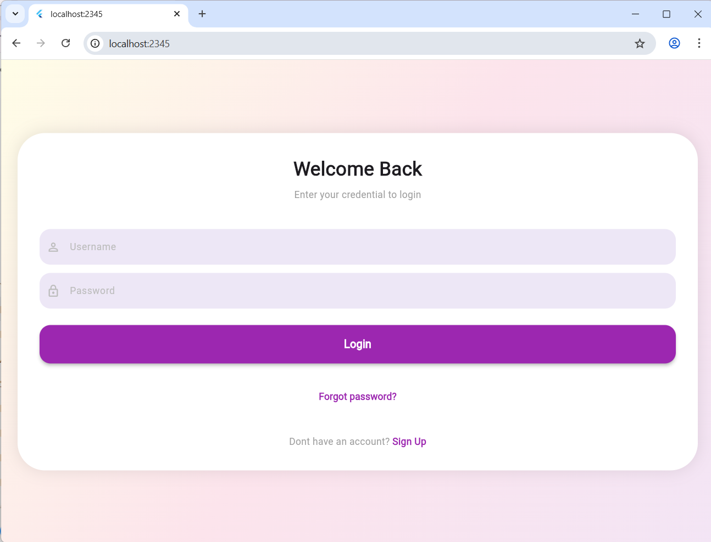
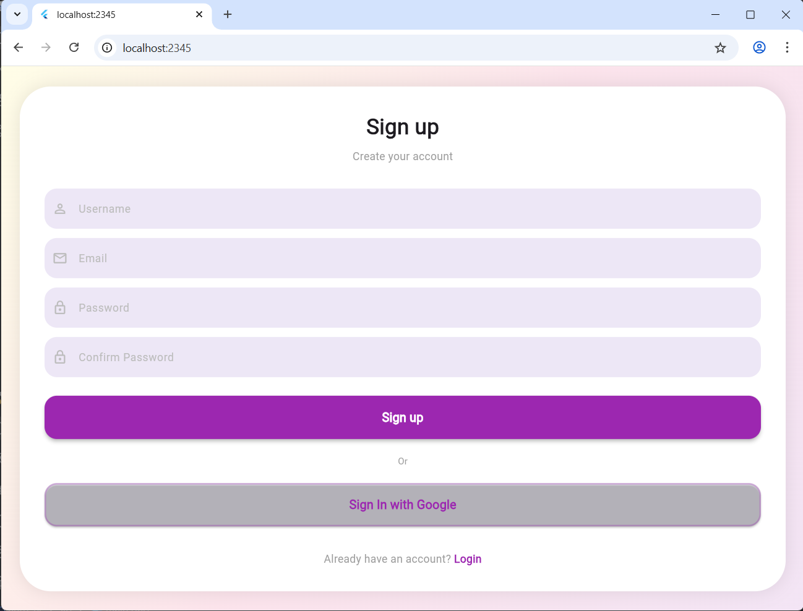

<<<<<<< HEAD
# auth_ui

A new Flutter project.

## Getting Started

This project is a starting point for a Flutter application.

A few resources to get you started if this is your first Flutter project:

- [Learn Flutter](https://docs.flutter.dev/get-started/learn-flutter)
- [Write your first Flutter app](https://docs.flutter.dev/get-started/codelab)
- [Flutter learning resources](https://docs.flutter.dev/reference/learning-resources)

For help getting started with Flutter development, view the
[online documentation](https://docs.flutter.dev/), which offers tutorials,
samples, guidance on mobile development, and a full API reference.
=======
# Auth UI Flutter Project

This is a simple Flutter Authentication UI project with Login and Signup screens.

## 🚀 Features
- Login Screen
- Signup Screen
- Smooth Animation
- Clean UI Design

## 📱 Screenshots

## 🎥 Demo Video
https://youtu.be/your_video_link

## 🔗 GitHub Repository
https://github.com/LaxmiShaha028/Auth-UI
>>>>>>> 0d96303ed3bb9372d9f026fd3b53544375964d87
